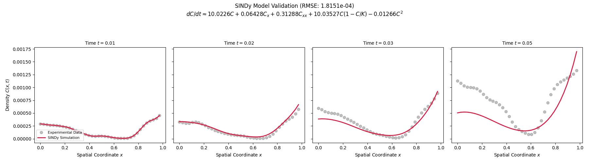
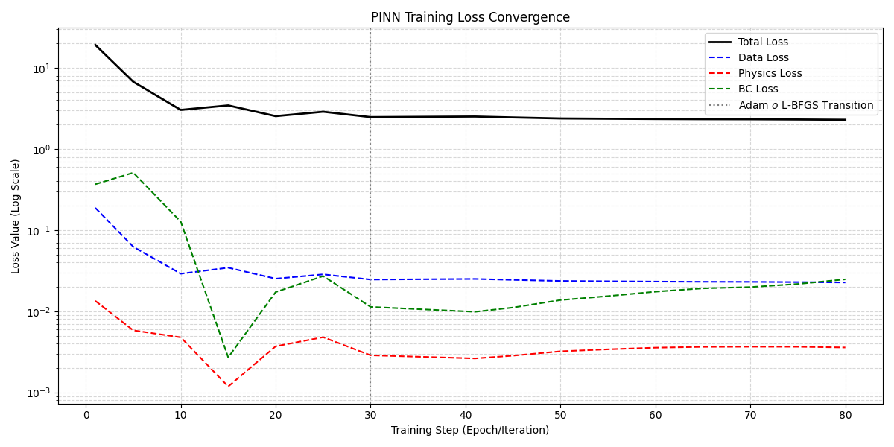
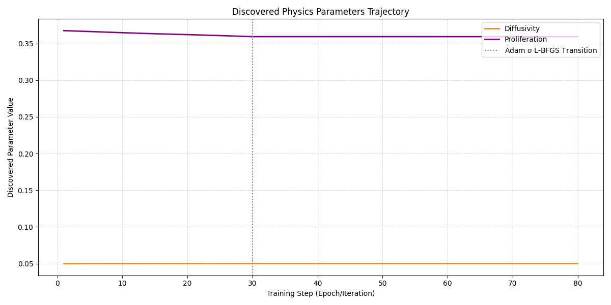
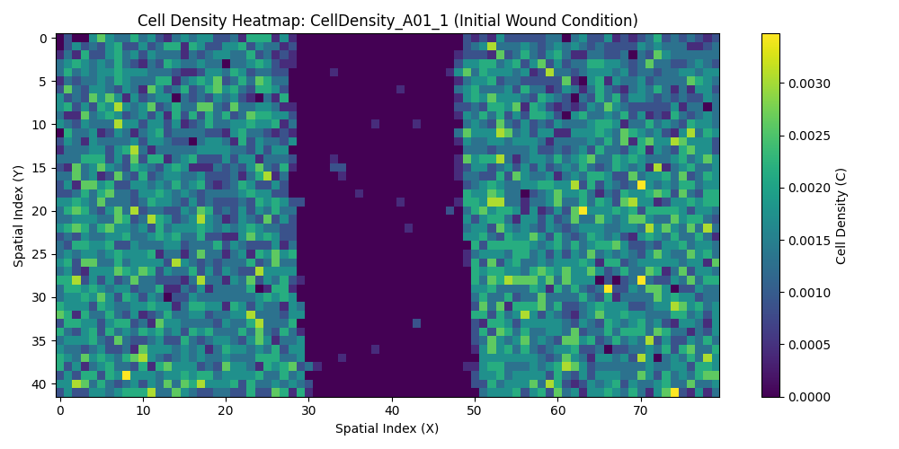

# Inference of Wound Healing using Physics-Informed Neural Networks (PINNs) and SINDy

This repository provides a comprehensive framework for inferring the governing biological mechanisms of wound healing from experimental cell density data. We implement two state-of-the-art methodologies: **Sparse Identification of Nonlinear Dynamics (SINDy)** and **Physics-Informed Neural Networks (PINNs)**.

## Project Structure

- `wound_healing_jin/`: Implementation of the SINDy-based inference pipeline.
- `wound_healing_tram/`: Implementation of the PINN-based inference pipeline.

---

## The Mathematical Model: Fisher-KPP Equation

Wound healing is modeled as a reaction-diffusion process where cell density $C(x, t)$ evolves according to the Fisher-KPP equation:

$$\frac{\partial C}{\partial t} = \underbrace{D \nabla^2 C}_{\text{Diffusion}} + \underbrace{\rho C \left(1 - \frac{C}{K}\right)}_{\text{Logistic Growth}}$$

- **$D$**: Diffusion coefficient, representing random cell motility.
- **$\rho$**: Growth rate, representing cell proliferation.
- **$K$**: Carrying capacity, representing the maximum cell density in a given space.

---

## Case 1: SINDy (Sparse Identification of Nonlinear Dynamics)

This approach treats model discovery as a sparse regression problem. We construct a "Basis Library" of candidate physical terms and identify the sparse subset that best explains the observed dynamics.

### Mathematical Approach
Given the temporal derivative $\dot{C}$, we solve for coefficients $\Xi$ in:
$$\dot{C} = \Theta(C)\Xi$$
Where $\Theta(C)$ contains terms like $\{1, C, C^2, \nabla C, \nabla^2 C, C\nabla^2 C, \dots\}$.

### Implementation Highlight: Feature Engineering
```python
# From wound_healing_jin/feature_engineering.py
def build_design_matrix(df, terms):
    """
    Assembles spatial terms (Gradient, Diffusion, Logistic, etc.) into a matrix Theta.
    Rows = Every point in space-time.
    Columns = Value of each specific candidate term.
    """
    Theta = df[terms]
    Y = df['dC_dt']
    return Theta, Y
```

### Implementation Highlight: Sparse Regression (STRidge)
```python
# From wound_healing_jin/regressors.py
def fit_stridge(self, X, y):
    """
    Sequential Threshold Ridge Regression: Prunes coefficients below a 
    certain threshold to find the simplest consistent model.
    """
    coeffs = ridge_regression(X, y)
    for _ in range(max_iterations):
        small_indices = np.abs(coeffs) < threshold
        coeffs[small_indices] = 0
        coeffs[~small_indices] = ridge_regression(X[~small_indices], y)
    return coeffs
```

### Visualization

*Comparison between the SINDy-discovered model simulation and experimental data.*

---

## Case 2: PINNs (Physics-Informed Neural Networks)

PINNs integrate the PDE directly into the neural network's architecture. The network $\hat{C}(x, t; \theta)$ is trained to minimize both the data mismatch and the PDE residual.

### Mathematical Approach
The total loss function is defined as:
$$L_{\text{total}} = L_{\text{data}} + \lambda_{\text{phys}} L_{\text{phys}} + \lambda_{\text{bc}} L_{\text{bc}}$$

Where the physics loss $L_{\text{phys}}$ enforces the Fisher-KPP residual:
$$L_{\text{phys}} = \frac{1}{N_{f}} \sum_{i=1}^{N_{f}} \left[ \frac{\partial \hat{C}}{\partial t} - D \nabla^{2} \hat{C} - \rho \hat{C}(1 - \hat{C}) \right]^{2}$$

### Implementation Highlight: Physics Residual (Autograd)
```python
# From wound_healing_tram/pinn_loss_functions.py
def compute_physical_residual(model, X_collocation):
    C_hat = model(X_collocation)
    
    # Compute derivatives using Automatic Differentiation
    C_t = autograd.grad(C_hat, X_collocation, grad_outputs=torch.ones_like(C_hat), create_graph=True)[0][:, 2]
    C_x = autograd.grad(C_hat, X_collocation, grad_outputs=torch.ones_like(C_hat), create_graph=True)[0][:, 0]
    C_xx = autograd.grad(C_x, X_collocation, grad_outputs=torch.ones_like(C_x), create_graph=True)[0][:, 0]

    # Parameters D and rho are learned simultaneously with the network weights
    D, rho = model.pde_params
    
    # Residual of the Fisher-KPP equation
    f_residual = C_t - D * C_xx - rho * C_hat * (1 - C_hat)
    return f_residual
```

### Visualization: Results and Convergence
#### Parameter Inference & Loss
| Loss Convergence | Parameter Discovery |
| :---: | :---: |
|  |  |

#### Reconstructed Density Field

*Reconstruction of the wound healing process across the spatio-temporal domain using the trained PINN.*

---

## How to Run

### Installation
```bash
pip install -r requirements.txt
```

### Run SINDy Pipeline
```bash
python wound_healing_jin/main_pipeline.py
```

### Run PINN Pipeline
```bash
python wound_healing_tram/pinn_pipeline.py
```

## Authors
This project explores the intersection of deep learning and biomechanics for robust parameter inference in biological systems.
